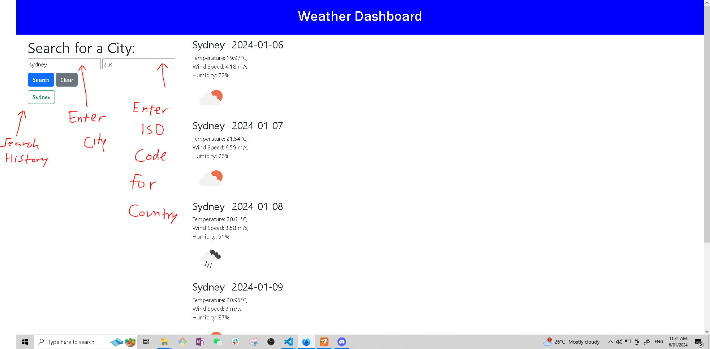

# Jimmy-Wu-Work-Portfolio
## Codebase for Weather Dashboard

## Description
The purpose of this project was to create a weather dashboard for users looking to plan an upcoming trip to a desired city. The HTML and CSS were written from scratch and (refer to index.html and style.css inside assets > css > style.css). This portfolio uses OpenWeatherMap's geo-coding API to make it easy and straightforward to generate a 5-day forecast for users, as it conveniently also dynamically generates a corresponding weather image matching the current conditions of the city - be it rainy, cloudy, sunny etc. Including an ISO 3166 country code input ensures that cities with the same name can be distinguished. 

## Learnings/takeaways
Takeaways from completing this project include the application of concepts server-side API's. Although the intention was to include 6 days worth of data (1 data point for the current day and 5 thereafter for the next 5 days from the current date), this became challenging as the weather API would only return 5 data points depending on what time of the day it was fired off at. As a result, it was decided that 5 data points including the current day (at midday, 12:00pm) data for temperature, wind speed, and humidity were included to maintain consistency. Aside from that, being able to return the data received from the API as a JSON object was another learning for this project and was good practice for solidifying understanding. 

        
## Installation
N/A

## Usage 
Go to link: https://jpwu23.github.io/Jimmy-Wu-Portfolio/ Enter a city name and a correpsonding ISO 3166 country code to generate a 5-day forecast of said city. You can Google this country code e.g. enter this in the corresponding inputs: London, GB

## Credits
ChatGPT, University of Sydney/edX Coding Bootcamp course resources. 

## License
N/A
